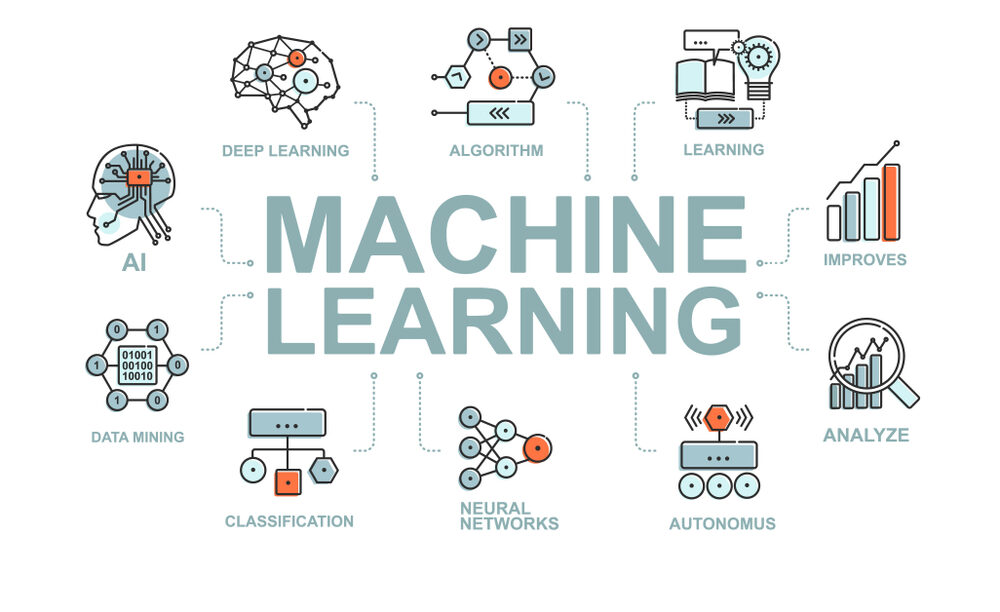
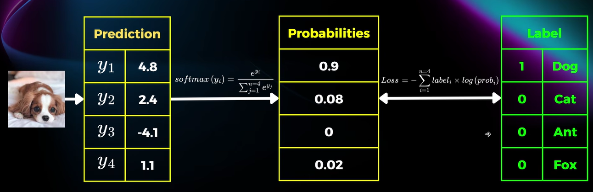

 <h1 align="center">Machine Learning</h1>

 

## Supervised Learning
### Regression
Target: dự đoán là những giá trị nằm tròng dải liên tục không đếm được.
Example: Dự đoán thời tiết, giá nhà,...

### Classification
Target: dự đoạn những giá trị dời dạc và số lượng label giới hạn.
Example: dự đoán ảnh chó mèo,....

## Unsupervised Learning
### Clustering(phân cụm)
Target: phân chia điểm dữ liệu thành k nhóm khác nhau sao cho cùng nhóm có feature tương đồng còn khác nhóm thì khác biệt nhau. Khác với Classification ở chỗ không thể giải thích(Unsupervised) và không biết dữ liệu được phân chia theo feature nào.
Example: phân chia công việc thành 3 nhóm,...

### Association
Target: tìm điểm tương đồng 
Example: Recommend system(google search, ...)

## Reinforcement Learning
Khó chỉ phù hợp trong môi trường nghiên cứu
Đối tượng huấn luyện: Agent
Ý tưởng: Đặt Agent vào trong Environment -> action -> reward -> point or penalty

## Semi Supervised Learning
Là kết hợp giữ Supervised và Unsupervised -> dữ liệu gồm labeled(thường ít) và unlabeled

## Data
Dữ liệu là unlabeled hay labeled data còn tuỳ thuộc vào bài toán.
### Numerical feature
Dạng số dời rạc(Discrete) hoặc liên tục(Continuous)
Chú ý: một số trường hợp số (số điện thoại, ID,...) ko phải numerical feature vì numerical phải có lớn nhỏ thứ bậc.

### Categorical feature
Thuộc tính dạng phân loại hưu hạn giá trị khác nhau
- Nominal(định danh): Bình đẳng về mặt ý nghĩa vd(quốc tịch, ...)
- Ordinal(thứ tự): Size(S, M, L...)
- Boolean

## Data splitting
Train Set: Dữ liệu huấn luyện trực tiếp cải thiện performance model được ví như sách vở
Validation Set: Dữ liệu đánh giá model ví như kiểm tra thường xuyên.
Test set: Dữ liệu kiểm thử đánh giá model cuối cùng ví như final test.

## Loss function
### Regression
MAE(Mean Absolute Error) = (e0 + e1 + ...+ en) / (n+1)
MSE(Mean Squared Error) = ((e1)^2 + (e2)^2 + ...) /(n+1)

MSE khuếch đại mất mát để mô hình tập trung vào sai số lớn nhưng nhược điểm là không quá chính xác(khi 0<e<1 khó tối ưu).
MAE có những model sai số lớn khi huấn luyện tốt thì độ chính xác cao hơn.

Model Optimize -> Minimal Loss

Coefficient of Determination: R^2 = 1-(e1^2 + e2^2 + ...)/((y1-y_mean)^2 + (y2-y_mean)^2 + ...)

### Classification
Cross Entropy Loss: 

 

Loss = -(1 . log(0.9) + 0 . log(0.08) + 0 . log(0) + 0 . log(0.02))
